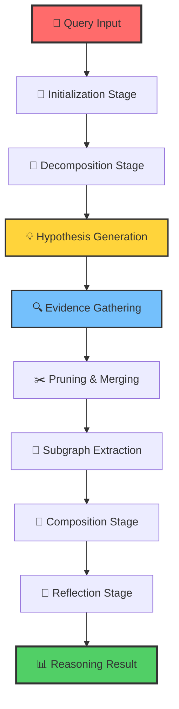

<div align="center">

# 🧠⚡ ThoughtNet-Engine

### *The Next-Generation Adaptive Graph of Thoughts Processor*

[](https://www.typescriptlang.org/)
[](https://nodejs.org/)
[](https://neo4j.com/)
[](https://expressjs.com/)

**🚀 Revolutionizing AI Reasoning Through Dynamic Thought Networks**

[🎯 **Live Demo**](#demo) • [📖 **Documentation**](#documentation) • [🤝 **Contributing**](#contributing) • [💬 **Community**](#community)

</div>

---

## 🌟 **What is ThoughtNet-Engine?**

> *"Beyond Linear Thinking: Where AI Thoughts Interconnect and Evolve"*

ThoughtNet-Engine is a **groundbreaking Adaptive Graph of Thoughts (GoT) processor** that transforms how AI systems reason and make decisions. Unlike traditional linear processing, it constructs and navigates **dynamic, interconnected networks of thoughts**, enabling unprecedented depth, flexibility, and intelligence in problem-solving.

<div align="center">



</div>

---

## ✨ **Revolutionary Features**

### 🧠 **Cognitive Architecture**
- **🔄 Adaptive Graph Construction**: Dynamically builds and refines thought networks in real-time
- **🧩 Multi-Stage Reasoning Pipeline**: 8-stage sophisticated processing pipeline for complex problem-solving
- **🎯 Intelligent Hypothesis Generation**: AI-driven hypothesis creation with evidence-based validation
- **🔍 Advanced Evidence Synthesis**: Real API integrations with PubMed, Google Scholar, and Exa Search for live research data

### 🛡️ **Enterprise-Grade Reliability**
- **💾 Smart Checkpointing**: Advanced state management with rollback capabilities
- **⚡ Resource Optimization**: Intelligent resource monitoring and automatic scaling
- **🔒 Security First**: Rate limiting, authentication, and secure API endpoints
- **📊 Real-time Analytics**: Comprehensive metrics and performance monitoring

### 🔧 **Developer Experience**
- **🎨 Modular Architecture**: Plugin-based system for easy customization
- **📡 RESTful APIs**: Clean, well-documented API interfaces
- **🧪 Extensive Testing**: Comprehensive test suite with Jest
- **📝 TypeScript**: Full type safety and excellent IDE support

---

## 🏗️ **Architecture Overview**

<details>
<summary><b>📁 Project Structure</b> (Click to expand)</summary>

```
ThoughtNet-Engine/
├── 🚀 src/
│   ├── 📱 api/                    # API layer
│   │   ├── schemas.ts             # Data validation schemas
│   │   └── routes/                # Route handlers
│   │       ├── chatRoutes.ts      # Chat/conversation endpoints
│   │       ├── mcpPublicRoutes.ts # Public MCP endpoints
│   │       └── healthRoutes.ts    # Health check endpoints
│   │
│   ├── 🧠 application/            # Application services
│   │   └── gotProcessor.ts        # Core GoT processing logic
│   │
│   ├── 🏛️ domain/                 # Business logic & models
│   │   ├── interfaces/            # Core interfaces
│   │   ├── models/                # Domain models
│   │   ├── services/              # Domain services
│   │   ├── stages/                # Processing stages
│   │   └── utils/                 # Domain utilities
│   │
│   ├── 🏗️ infrastructure/         # External integrations
│   │   ├── neo4jDatabaseManager.ts
│   │   ├── neo4jGraphRepository.ts
│   │   └── apiClients/            # External API clients
│   │
│   ├── 🛡️ middleware/             # Express middleware
│   │   ├── auth.ts                # Authentication
│   │   └── security.ts            # Security policies
│   │
│   └── ⚙️ services/               # Infrastructure services
│       ├── llm.ts                 # Language model integration
│       ├── rateLimiter.ts         # Rate limiting
│       └── resourceMonitor.ts     # Performance monitoring
│
├── 🧪 tests/                      # Test suites
├── ⚙️ config/                     # Configuration files
└── 📋 docs/                       # Documentation
```

</details>

### 🔄 **Processing Stages**

| Stage | Purpose | Key Features |
|-------|---------|-------------|
| 🎯 **Initialization** | Bootstrap the reasoning process | Context setup, goal definition |
| 🧩 **Decomposition** | Break complex problems into manageable parts | Recursive decomposition, dependency analysis |
| 💡 **Hypothesis** | Generate potential solutions | AI-driven hypothesis creation, confidence scoring |
| 🔍 **Evidence** | Gather supporting information | Multi-source evidence collection, validation |
| ✂️ **Pruning & Merging** | Optimize the thought graph | Remove redundancies, merge similar concepts |
| 🎯 **Subgraph Extraction** | Focus on relevant thought clusters | Community detection, centrality analysis |
| 🔗 **Composition** | Synthesize final reasoning | Path analysis, confidence aggregation |
| 🤔 **Reflection** | Validate and refine results | Self-assessment, iterative improvement |

---

## 🚀 **Quick Start**

### 📋 **Prerequisites**
- **Node.js** 18+ 
- **Neo4j** 5+ database
- **TypeScript** 5+

### ⚡ **Installation**

```bash
# Clone the repository
git clone https://github.com/your-username/ThoughtNet-Engine.git
cd ThoughtNet-Engine

# Install dependencies
npm install

# Set up environment variables
cp .env.example .env
# Edit .env with your configuration

# Build the project
npm run build

# Start the server
npm start
```

### 🔧 **Configuration**

```typescript
// Example configuration
const config = {
  neo4j: {
    uri: "bolt://localhost:7687",
    user: "neo4j",
    password: "your-password"
  },
  server: {
    port: 3000,
    host: "localhost"
  },
  reasoning: {
    maxDepth: 10,
    confidenceThreshold: 0.7
  }
};
```

### 🌐 **External API Integration**

For real evidence gathering from external sources:

```bash
# Configure in .env file
EXA_API_KEY=your-exa-api-key                 # Neural search engine
PUBMED_API_KEY=your-ncbi-api-key             # Biomedical literature  
GOOGLE_SCHOLAR_API_KEY=your-serpapi-key      # Academic papers
```

> 📖 **See [API Integration Guide](docs/API_INTEGRATION.md) for detailed setup instructions**

**Supported APIs:**
- **PubMed** (NCBI E-utilities) - Free biomedical literature access
- **Google Scholar** (via SerpAPI) - Academic papers across disciplines  
- **Exa Search** - Neural web search for research content

*Works with mock data when APIs not configured - perfect for development!*

---

## 📚 **API Reference**

### 🎯 **Core Endpoints**

| Endpoint | Method | Description |
|----------|--------|-------------|
| `/api/v1/reason` | POST | Process a reasoning query |
| `/api/v1/graph/analyze` | POST | Analyze thought graph structure |
| `/api/v1/health` | GET | Check system health |
| `/api/v1/metrics` | GET | Get performance metrics |

### 💡 **Example Usage**

```typescript
// Reasoning Query
const response = await fetch('/api/v1/reason', {
  method: 'POST',
  headers: { 'Content-Type': 'application/json' },
  body: JSON.stringify({
    query: "What are the implications of quantum computing on cryptography?",
    analysisType: "comprehensive",
    confidenceThreshold: 0.8
  })
});

const result = await response.json();
// Returns: ReasoningResult with answer, confidence, evidence, and graph metrics
```

---

## 🎯 **Use Cases**

<div align="center">

| 🔬 **Research** | 🏢 **Enterprise** | 🎓 **Education** | 🤖 **AI Development** |
|-----------------|-------------------|------------------|----------------------|
| Literature analysis | Decision support | Learning assistance | Reasoning benchmarks |
| Hypothesis testing | Strategic planning | Concept mapping | Model evaluation |
| Knowledge synthesis | Risk assessment | Critical thinking | Cognitive modeling |

</div>

---

## 🌟 **Why Choose ThoughtNet-Engine?**

### 🆚 **Traditional AI vs ThoughtNet-Engine**

| Aspect | Traditional AI | ThoughtNet-Engine |
|--------|---------------|-------------------|
| **Processing** | Linear, sequential | Dynamic, networked |
| **Reasoning** | Single-path | Multi-path exploration |
| **Adaptability** | Static models | Self-evolving graphs |
| **Evidence** | Limited integration | Multi-source synthesis |
| **Transparency** | Black box | Explainable reasoning paths |

---

## 🧪 **Development**

### 🔧 **Development Setup**

```bash
# Install development dependencies
npm install

# Run in development mode
npm run dev

# Run tests
npm test

# Run linting
npm run lint

# Format code
npm run format
```

### 🧩 **Extending ThoughtNet-Engine**

Create custom processing stages:

```typescript
import { BaseStage } from '../stages/baseStage';

export class CustomAnalysisStage extends BaseStage {
  async process(context: ProcessingContext): Promise<ProcessingResult> {
    // Your custom logic here
    return {
      success: true,
      updatedNodes: [],
      metadata: {}
    };
  }
}
```

---

## 📊 **Performance & Scalability**

- **⚡ Lightning Fast**: Sub-second response times for most queries
- **📈 Horizontally Scalable**: Designed for distributed deployment
- **💾 Memory Efficient**: Optimized graph storage and processing
- **🔄 Real-time Processing**: Streaming updates and live reasoning

---

## 🤝 **Contributing**

We welcome contributions from developers, researchers, and AI enthusiasts worldwide!

### 🎯 **How to Contribute**

1. **🍴 Fork** the repository
2. **🌿 Create** a feature branch (`git checkout -b feature/amazing-feature`)
3. **💾 Commit** your changes (`git commit -m 'Add amazing feature'`)
4. **📤 Push** to the branch (`git push origin feature/amazing-feature`)
5. **🔄 Open** a Pull Request

### 🐛 **Reporting Issues**
Found a bug? Have a feature request? [Open an issue](https://github.com/your-username/ThoughtNet-Engine/issues) and let's discuss!

---

## 🌐 **Community & Support**

<div align="center">

[](https://discord.gg/your-server)
[](https://twitter.com/your-handle)
[](https://linkedin.com/company/your-company)

**Join our growing community of AI researchers and developers!**

</div>

---

## 📄 **License**

This project is licensed under the **MIT License** - see the [LICENSE](LICENSE) file for details.

---

## 🙏 **Acknowledgments**

- **Neo4j** for graph database excellence
- **TypeScript** community for robust tooling
- **Express.js** for reliable web framework
- **All contributors** who make this project possible

---

<div align="center">

## 🚀 **Ready to Transform AI Reasoning?**

**ThoughtNet-Engine: Where Thoughts Connect, Intelligence Emerges**

[⭐ **Star us on GitHub**](https://github.com/your-username/ThoughtNet-Engine) • [🐦 **Follow for Updates**](https://twitter.com/your-handle) • [💬 **Join the Discussion**](https://discord.gg/your-server)

---

*Built with ❤️ by the ThoughtNet-Engine Team*

</div>
